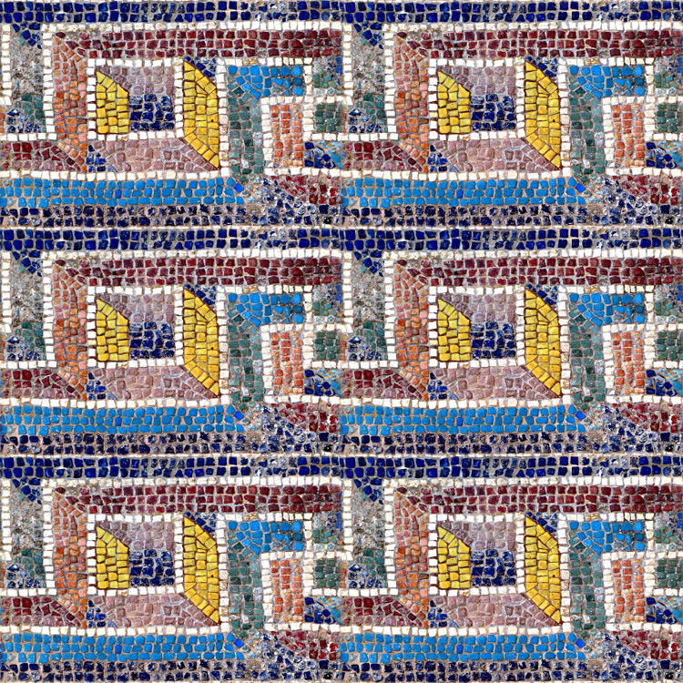

# PyTorch Implementation of Style Transfer as Optimal Transport

[Style Transfer as Optimal Transport - Paper and Tensorflow Implementation](https://github.com/VinceMarron/style_transfer)

(I'm not able to provide a open-source license because the original author did not provide a license, and I used some of his code in this implementation.)

## Environment

* This project is currently tested against `pytorch-nightly-1.0.0.dev20181008`  (Pytorch 1.0.0 Preview) from conda *pytorch* channel and `torchvision` from Github master branch. 
* A Dockerfile is also provided. 
* It uses CUDA by default.

### Using Docker

You'll need to install [nvidia-docker](https://github.com/NVIDIA/nvidia-docker) for GPU acceleration.

Build the Docker Image with the accompanied Dockerfile, and use `docker run` to start a container. 

An example (assuming the image name is `pytorch_nightly:latset` and the working directory is the root of the project.):

```bash
docker run --runtime=nvidia -ti -v (pwd):/home/docker --rm pytorch_nightly:latest bash
```

### Using Conda

Please refer to the conda and pip installation commands in the Dockerfile to replicate the Python environment.

### Using Pip & Other Methods

You'll have to build the latest PyTorch from source or use an older PyTorch version. I cannot guarantee it will work, though.

## CLI Usage Example

```bash
python cli.py --subject content_images/wave_small.jpg --style style_images/kngwa_small.jpg --output wave_kngwa.jpg --steps 100 --log_interval 10
```

## Demo

### The Great Wave off Kanagawa


### Ribbon Mossaic




